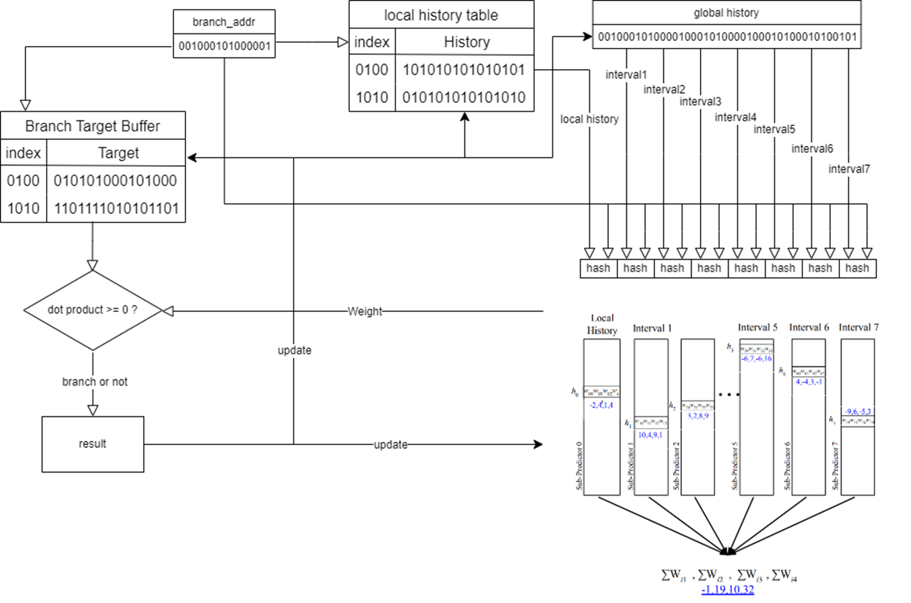
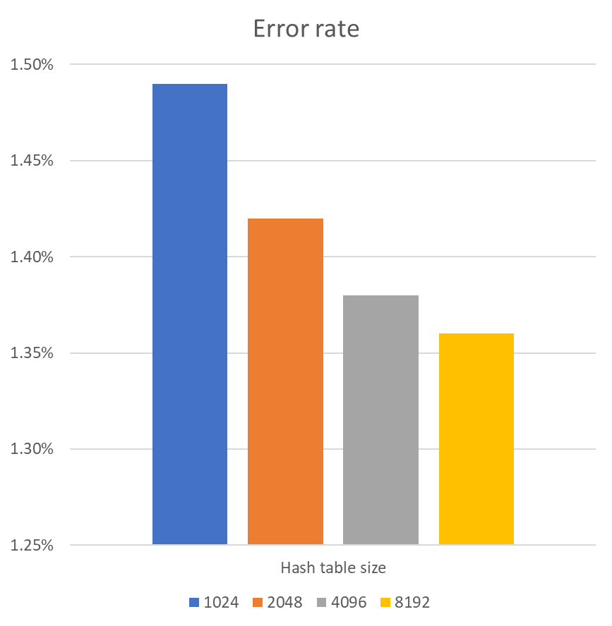
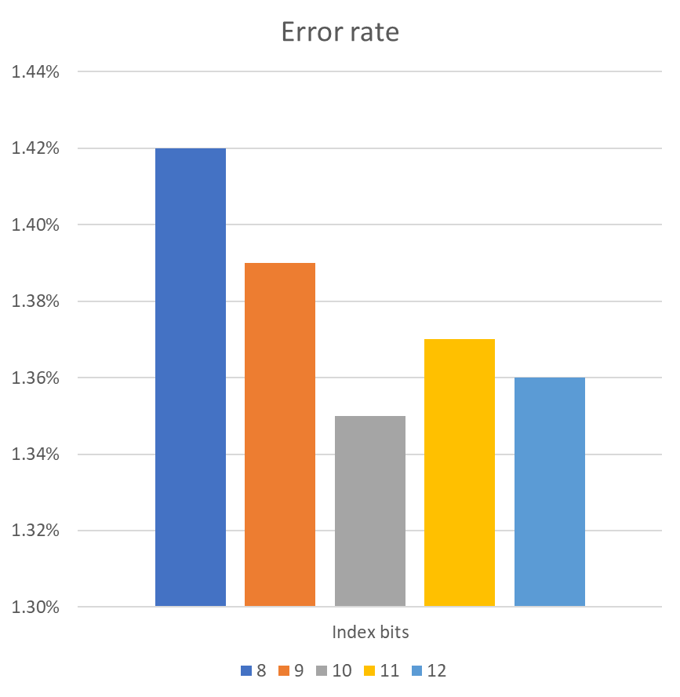

# Advance Computer Architecture Final project
## This project implement and modify [Bit-level perceptron prediction for indirect branches](https://dl.acm.org/doi/pdf/10.1145/3307650.3322217)

## Workflow

## Performance

